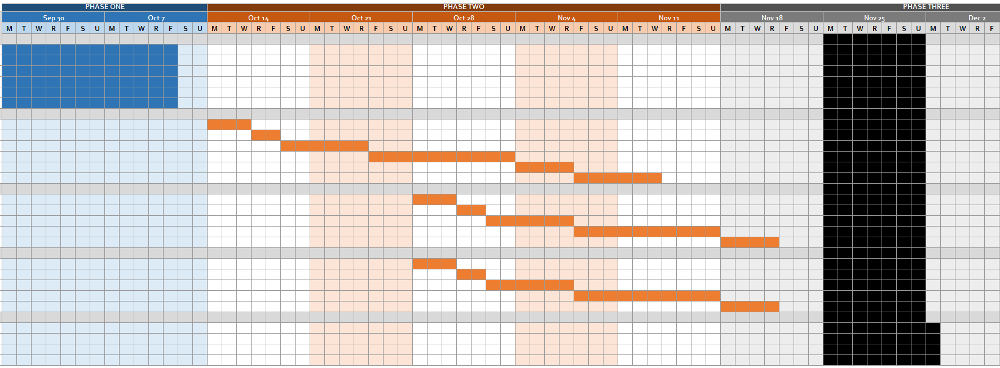

# Project Final Report: Team 38
*Annabelle Xie, Alex Latz, Anthony Nguyen, Pennon Shue, Rohan Karthik*
## Introduction/Background

The increase in internet access by adolescents in recent years has led to a significant rise in problematic internet use (PIU): the excessive use of the internet that interferes with daily life. Studies suggest that a Preference for Online Social Interaction (POSI) and those using the internet to regulate emotions can lead to compulsive internet use and negative outcomes \[6\], \[7\], \[5\]. Evidence also shows that poor physical health is associated with excessive screen time \[10\]. However, there is limited attention on physical activity as a PIU predictor.

The Healthy Brain Network has compiled a dataset from roughly 5,000 participants aged 5 to 22, capturing physical activity and internet behavior data. Fitness data includes medical measurements, fitness assessments, bio-electric impedance analysis, and actigraphy series data, while internet usage is measured through usage reports and a parent-child internet addiction test. Each participant has an associated Severity Impairment Index (SII), a standard for measuring problematic internet use.

Dataset:
<https://www.kaggle.com/competitions/child-mind-institute-problematic-internet-use/data>

## Problem Definition

PIU is a growing concern in the digital age and a contributor to mental health issues especially in adolescents whose brains are more vulnerable \[10\], \[8\]. Prolonged PIU habits can exacerbate mental health challenges and disrupt social and emotional learning.

COVID-19 has intensified this issue, with studies showing a sharp rise in PIU symptoms from a pre-pandemic rate of 10-14% to 40% \[2\], \[4\], as children rely more on online platforms for social interaction. Current PIU diagnosis methods require clinical intervention and lack early diagnosis. With PIU now affecting nearly half of adolescents, there’s a critical need for accessible tools to predict PIU risk and promote healthier digital habits \[3\]. This project aims to provide a scalable solution for early intervention in young populations.

## Methods

### Data Preprocessing 

1. Missing Data Handling:
    1. Removal of Features: We decided to remove columns such as identifiers (‘id’), each PCIAT score (‘PCIAT-PCIAT_##’) with the exception of the total PCIAT score, and any seasonal attributes (“Basic_Demos-Enroll_Season”) that don’t contribute to prediction. Additionally, columns with over 45% missing data were removed. This ensures that the model doesn’t attempt to impute excessively incomplete data, which could introduce noise.
    2. Imputation: The ‘KNNImputer’ was chosen due to its ability to fill in missing values based on similarity to closest neighbors. ‘KNNImputer’ uses patterns in the data to provide more accurate estimates, unlike simpler imputation methods that might fill missing values with the mean or median. The labeled data in the training dataset is imputed first, and the patterns are used to fill in missing values for features in the untrained data. A similar imputation process is also done to the test dataset, ensuring that it is consistent with the training data.
2. Handling Imbalanced Data
     1. SMOTE was applied to address class imbalances in the training data, ensuring that underrepresented classes are sufficiently represented. By generating synthetic samples without altering distribution of the majority class or removing any original data points, SMOTE reduces the risk of overfitting and increases generalizability of the model. 

## ML Algorithms/Models

- **Unsupervised and Supervised Learning Methods**
  -  Supervised:
     -  **KNN**
     -  **Random Forest Classifier**
  - Unsupervised:
    - **GMM**

- **Full Random Forest Approach**: This approach was designed to capitalize on RF's ability to model complex, non-linear relationships and handle diverse feature interactions. Initially, an RF model was trained on the labeled portion of the training data to generate pseudo-labels for the unlabeled subset. These pseudo-labels filled in missing labels based on learned patterns. After pseudo-labeling, the labeled and pseudo-labeled data were combined to form an expanded dataset. This dataset was used to retrain the RF model, which allowed it to refine its predictions based on the combined data. RF was selected for its robustness against overfitting and its ability to interpret feature contributions, making it a reliable choice for classification tasks involving partially labeled data.
- **Full K-Nearest Neighbors Approach**: This approach followed a similar two-stage process, leveraging KNN's proximity-based classification capabilities. KNN was initially used to assign pseudo-labels to the unlabeled subset by examining the labels of nearby samples in the labeled data, with 𝑘 = 20 as the number of neighbors for majority voting. This step provided pseudo-labels for the training dataset. Once pseudo-labels were generated, the labeled and pseudo-labeled data were combined into a single training set. A KNN model was then retrained on this dataset to improve its predictions. KNN was chosen for its simplicity and flexibility, particularly its effectiveness in handling pseudo-labeled data and its ability to adapt to scenarios with partially missing data.
- **Gaussian Mixture Model Approach**: We chose a GMM approach for our unsupervised learning method, as its ability to create more flexible cluster shapes based on Gaussian distributions would help us to find the limitations of our KNN model and to detect the complex relationships of each SII class. We conducted an elbow test with BIC scores resulting from each number of GMM components to arrive at our final component number of 48. Finally, we mapped each cluster to the most frequent true label of that cluster.

## **Results/Discussion**

#### **KNN Classifier:**

* **Quantitative Metrics**:  
  * The KNN model achieved an overall accuracy of **86%** on the labeled training data, with a weighted average F1-score of **0.86**, indicating robust performance across all classes. The model demonstrated very high precision (**0.99**) and strong recall (**0.83**) for the majority class (**0.0**). This resulted in a high F1-score of **0.90**. Class **1.0** had a precision of **0.69** and a great recall of **0.91**, leading to an F1-score of **0.79**. Class **2.0** showed balanced precision (**0.85**) and recall (**0.88**) with an F1-score of **0.86**. Although the model displayed a great recall of the rare class **3.0** at **0.97**, the precision for this class was moderate at **0.56**, yielding an F1-score of **0.71**.  
* **After SMOTE:**   
  * For minority classes, precision and recall have improved. However, the F1-score remains lower for this minority class 3.0, indicating there is still room for improvement in capturing the minority classes fully.  
  * The macro average F1-score improved to 0.79, and the weighted average F1-score is now 0.86, showing a more balanced performance across classes.

#### **Random Forest Classifier:**

* **Quantitative Metrics**:  
  * The Random Forest model had an overall accuracy of **82%** on the labeled training data, accompanied by a weighted average F1-score of **0.84**. For the majority class **0.0**, RF showcased great precision (**0.96**) and recall (**0.96**), leading to a near perfect F1-score of **0.96**. Class **1.0** had a decent precision of **0.81** and a recall of **0.72**, resulting in an F1-score of **0.76**, while class **2.0** exhibited lower performance with a precision of **0.71** and a recall of **0.44**. This led to a lower F1-score of **0.54**. The model struggled with the small class **3.0**, achieving a high recall of **0.70** but a very low precision of **0.10**. This highlights challenges in accurately classifying this infrequent category.  
* **After SMOTE:**  
  * Random Forest achieves near-perfect accuracy (100%), with most metrics at or close to 1.0 for all classes. Only SII 3.0, has a recall of 0.80. For minority classes like class 2.0, SMOTE has enhanced performance significantly.  
  * The macro average F1-score is 0.97 and the weighted average F1-score is 1.0 which shows a very balanced pre-processing labeling performance.

**Gaussian Mixture Model:**

* **Quantitative Metrics**:  
  * The GMM model had an overall accuracy of **66%** on the labeled training data, accompanied by a weighted average F1-score of **0.65**. For the majority class **0.0**, GMM showcased acceptable precision (**0.72**) and recall (**0.83**), leading to a decent F1-score of **0.77**. Class **1.0** had a terrible precision of **0.45** and a recall of **0.36**, resulting in an F1-score of **0.40**, while class **2.0** exhibited lower performance with a precision of **0.84** and a recall of **0.47**. This led to a lower F1-score of **0.61**. The model was better with the small class **3.0**, achieving a perfect recall of **1.00** and a medium precision of **0.52**. It clearly struggled to differentiate between classes **0.0** and **1.0**, but had significant success in classifying **3.0** and acceptable performance with **2.0**.  
* **After SMOTE:**  
  *  The performance on class **0.0** decreased noticeably (F1 score of **0.68**) anbut all other classes saw significant improvements. Class **3.0**, for example, saw its precision rise to **0.94** while its accuracy shrank slightly to **0.98**, meaning that GMM with SMOTE was by far the best model at classifying **3.0**.  
  * The F1 scores of classes **0.0** through **2.0** all stayed below the performance of RF or KNN. This suggests that GMM was most effective at classifying children with SII 3.0, so it may be the most useful model in this context.

**PCA Visualizations**:

* **Pseudo Labeling**  
  * **KNN:** The pseudo labeled data visualization shows KNN predicting many samples as class 0.0, consistent with its tendency to rely on majority class predictions.   

  * **RF:** The pseudo labeled data plot reveals that Random Forest, like KNN, predicts many samples as class 0.0, indicating a majority class bias. However, RF predicts significantly more in class 3.0 than KNN does.

* **Labeled Data**  
  * **KNN:** Although there is tremendous overlap between classes 0.0 and 1.0, distinctions can clearly be seen in the different classes.  

  * **RF:** RF displays similar overlaps between classes 0.0 and 1.0 as KNN does. However, its distinction between 2.0 and 3.0 is very different from that in KNN. Many data points classified by KNN as 2.0 are classified as 3.0 by RF. RF seems to more significantly (though potentially incorrectly) differentiate 2.0 from 3.0.  

  * **GMM:** GMM significantly differentiates class 3.0, while struggling with heavy overlap between classes 0.0 and 1.0. Class 2.0 is still somewhat differentiated, although not to the extent that it was in the RF and GMM models.

  * **True Data**: Our dataset is very well separated by PCA analysis, so this proves to be a helpful way of visualizing each models’ strengths and weaknesses.

**Overall Analysis and Comparison:**

* The **Random Forest (RF) approach** exhibits strong performance in accurately classifying the majority class (**0.0**), achieving a high precision and recall which underscores its capability to capture and leverage complex patterns within dominant classes. However, RF faces significant challenges with minority classes, notably class **2.0**, where it attains a modest recall of **0.44**, and the rare class **3.0**, marked by an extremely low precision of **0.10** despite a high recall of **0.70**. This indicates a bias towards overclassifying instances as **0.0** and **3.0**, likely due to the chosen max\_depth parameter and inherent class imbalances. Conversely, the **K-Nearest Neighbors (KNN) approach** demonstrates stronger performance in handling the more contextually important minority classes **2.0** and **3.0**, with balanced precision and recall scores of **0.85** and **0.88** for class **2.0**, and a precision of **0.56** alongside a high recall of **0.97** for class **3.0**. Although KNN maintains a slightly lower recall for the majority class **0.0** compared to RF, its ability to correctly classify the essential minority classes makes it a more effective model for this scenario where classifying PIUs of **2.0** and **3.0** is more important. The visualizations also agree with these findings. They show that RF disproportionately assigns more pseudo-labels to classes **0.0** and **3.0**, potentially leading to overfitting in these regions, whereas KNN maintains a more balanced distribution across all classes. Given the critical need for precise classification of the minority and rare classes, KNN emerges as the more suitable model, offering a better balance between overall accuracy and the reliability of predictions for the most important classes.  
* However, as our problem context focuses mostly on accurately classifying children with high problematic internet usage, our **GMM model** may be the best option, as it has an excellent F1-score of **0.96** for classifying class **3.0**. However, when it comes to the other classes it struggles significantly more to differentiate classes compared to the RF and KNN approaches. This can be seen in its F1-score of **0.68**, **0.53**, and **0.67** across classes **0.0**, **1.0**, and **2.0**.

**Next Steps:**

* **Preprocessing**:  
  * Overfitting during pseudo labeling can create overly confident labels that may not generalize well, even with SMOTE balancing the data. In the future, we want to create balanced pseudo labels without overfitting.  
  * Random Forest also runs the risk of overfitting given that accuracy is nearly at 100%. Future work should include cross-validation and testing on unseen data to ensure model robustness.  
* **Model:** Logistic Regression with Regularization  
  * Logistic Regression is a simple linear model, less likely to overfit, especially when adding ridge regression. L2 regularization will penalize overly complex models and reduce the influence of noisy pseudo labels from the overfit Random Forest.  
  * In addition, Logistic Regression doesn’t require a large amount of data to perform well and is less prone to overfitting than complex models, which would work well for our data set.  
* **Hyperparameter tuning:**  
  * Hyperparameter tuning is especially helpful for enhancing the performance of models with arbitrary parameters. By establishing a criterion, we can then evaluate variations of both RF and KNN with different hyperparameters to find a more accurate model.  
  * Popular libraries for implementing this include GridSearchCV from scikit-learn and Optuna.  
* **Hybrid Approaches:**  
  * Integrating ensemble methods to leverage the strengths of both RF and KNN for enhanced predictive performance.

**References:**

\[1\] M. A. Moreno, “Problematic internet use among US youth,” Archives of Pediatrics &amp; Adolescent Medicine, vol. 165, no. 9, p. 797, Sep. 2011. doi:10.1001/archpediatrics.2011.58

\[2\] Ł. Tomczyk, M. Szyszka, and L. Stošić, “Problematic internet use among youths,” Education Sciences, vol. 10, no. 6, p. 161, Jun. 2020. doi:10.3390/educsci10060161

\[3\] M. J. Guralnick, “Why early intervention works,” Infants &amp; Young Children, vol. 24, no. 1, pp. 6–28, Jan. 2011. doi:10.1097/iyc.0b013e3182002cfe

\[4\] F. W. Paulus et al., “Problematic internet use among adolescents 18 months after the onset of the COVID-19 pandemic,” Children, vol. 9, no. 11, p. 1724, Nov. 2022. doi:10.3390/children9111724

\[5\] R. LaRose, C. A. Lin, and M. S. Eastin, “Unregulated internet usage: Addiction, habit, or deficient self-regulation?,” Media Psychology, vol. 5, no. 3, pp. 225–253, Aug. 2003. doi:10.1207/s1532785xmep0503_01

\[6\] S. E. Caplan, “Theory and measurement of generalized problematic internet use: A two-step approach,” Computers in Human Behavior, vol. 26, no. 5, pp. 1089–1097, Sep. 2010. doi:10.1016/j.chb.2010.03.012

\[7\] S. E. Caplan, “A social skill account of problematic internet use,” Journal of Communication, vol. 55, no. 4, pp. 721–736, Dec. 2005. doi:10.1111/j.1460-2466.2005.tb03019.x

\[8\] M. M. Spada, “An overview of problematic internet use,” Addictive Behaviors, vol. 39, no. 1, pp. 3–6, Jan. 2014. doi:10.1016/j.addbeh.2013.09.007

\[9\] Published by Ani Petrosyan and A. 19, “Internet and social media users in the world 2024,” Statista,<https://www.statista.com/statistics/617136/digital-population-worldwide/#:~:text=Published%20by%20Ani%20Petrosyan%2C%20Aug,less%20than%20that%20of%20men>

\[10\] A. Restrepo et al., “Problematic internet use in children and adolescents: Associations with psychiatric disorders and impairment,” BMC Psychiatry, vol. 20, no. 1, May 2020. doi:10.1186/s12888-020-02640-x

## Gantt Chart

| **TASK TITLE** | **TASK OWNER** | **START DATE** | **DUE DATE** | **DURATION** |
| --- | --- | --- | --- | --- |
| Project Proposal | All | 10/1/2024 | 10/4/2024 |  3 |
| Introduction & Background | Rohan | 9/27/2024 | 10/4/2024 | 7   |
| Problem Definition | Pennon | 9/27/2024 | 10/4/2024 | 7   |
| Methods | Annabelle | 9/27/2024 | 10/4/2024 | 7   |
| Potential Results & Discussion | Tony | 9/27/2024 | 10/4/2024 | 7   |
| Video Recording | Alex | 9/27/2024 | 10/4/2024 | 7   |
| GitHub Page | Rohan | 9/27/2024 | 10/4/2024 | 7   |
| **KNN Model** |     |     |     |     |
| Data Sourcing and Cleaning | Annabelle/Pennon | 10/5/2024 | 10/10/2024 | 5   |
| Model Selection | Tony | 10/10/2024 | 10/12/2024 | 2   |
| Data Pre-Processing | Tony/Alex | 10/12/2024 | 10/18/2024 | 6   |
| Model Coding | Rohan/Alex | 10/18/2024 | 10/28/2024 | 10  |
| Results Evaluation and Analysis | Annabelle/Pennon | 10/28/2024 | 11/2/2024 | 4   |
| Midterm Report | All | 11/2/2024 | 11/8/2024 | 6   |
| **RF Model** |     |     |     |     |
| Data Sourcing and Cleaning | Annabelle | 10/28/2024 | 11/3/2024 | 5   |
| Model Selection | Alex | 11/3/2024 | 11/5/2024 | 2   |
| Data Pre-Processing | Rohan | 11/5/2024 | 11/11/2024 | 6   |
| Model Coding | Tony | 11/11/2024 | 11/21/2024 | 10  |
| Results Evaluation and Analysis | Pennon | 11/21/2024 | 11/25/2024 | 4   |
| **GMM Model** |     |     |     |     |
| Data Sourcing and Cleaning | Rohan | 10/28/2024 | 11/3/2024 | 5   |
| Model Selection | Tony | 11/3/2024 | 11/5/2024 | 2   |
| Data Pre-Processing | Pennon | 11/5/2024 | 11/11/2024 | 6   |
| Model Coding | Annabelle | 11/11/2024 | 11/21/2024 | 10  |
| Results Evaluation and Analysis | Alex | 11/21/2024 | 11/25/2024 | 4   |
| **Evaluation** |     |     |     |     |
| Model Comparison | All | 11/25/2024 | 12/3/2024 | 8   |
| Presentation | All | 11/25/2024 | 12/3/2024 | 8   |
| Recording | All | 11/25/2024 | 12/3/2024 | 8   |
| Final Report | All | 11/25/2024 | 12/3/2024 | 8   |

## Contribution Table

| **Name** | **Proposal Contributions** |
| --- | --- |
| Rohan Karthik | Model Coding, Results/Discussion, Visualizations, Presentation  |
| Alex Latz | Model Selection, Data Preprocessing, Model Coding, Presentation  |
| Anthony Nguyen |  Model Selection, Data Preprocessing, GitHub Pages, Presentation|
| Pennon Shue | Data Sourcing and Cleaning, Writeup, Results Evaluation and Analysis, Presentation  |
| Annabelle Xie | Data Sourcing and Cleaning, Writeup, Results Evaluation and Analysis, Presentation |
